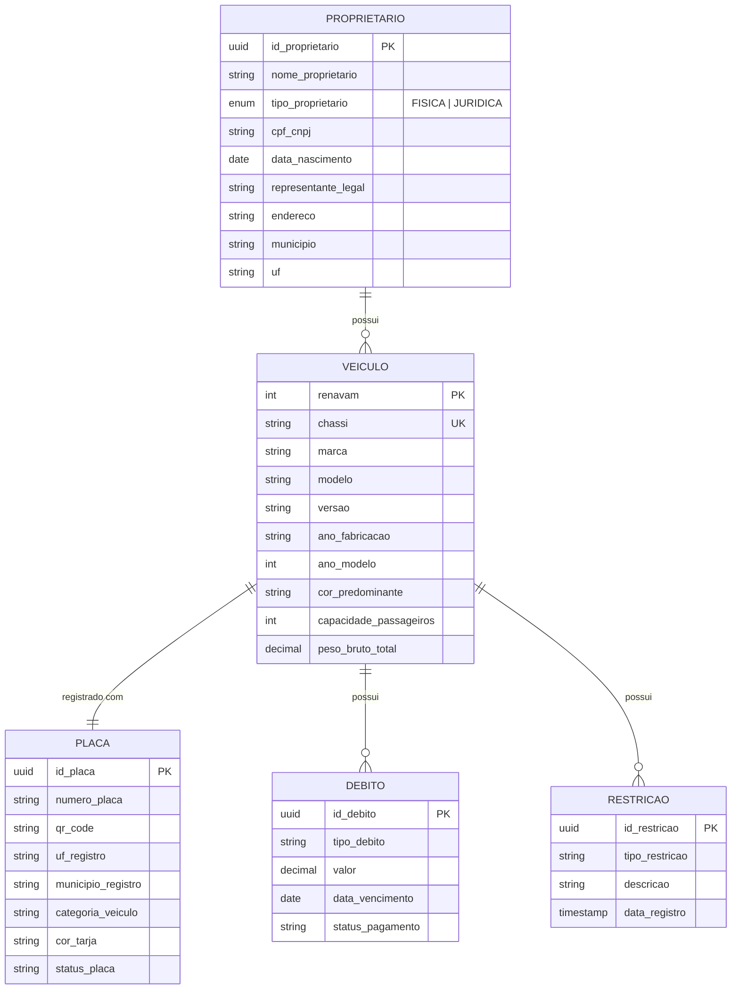

# 🚗 Entity Relations — Modelagem de Veículos com ORM

Projeto acadêmico desenvolvido para a disciplina de **Business Intelligence** (7º período) do curso de **Sistemas de Informação**.

A atividade original propunha a modelagem do banco de dados diretamente via SQL, mas optei por implementá-la com **ORM (TypeORM + NestJS)** — mapeando as entidades e seus relacionamentos em código — como forma de também treinar a stack que utilizo profissionalmente.

O domínio modelado é um **sistema de registro de veículos** (no estilo DETRAN), envolvendo proprietários, veículos, placas, débitos e restrições.

## 🗂️ Modelo de dados



### Relacionamentos mapeados

| Relação | Cardinalidade | Mapeamento TypeORM |
|---------|---------------|--------------------|
| Proprietário → Veículos | 1 : N | `@OneToMany` / `@ManyToOne` |
| Veículo → Placa | 1 : 1 | `@OneToOne` + `@JoinColumn` |
| Veículo → Débitos | 1 : N | `@OneToMany` / `@ManyToOne` |
| Veículo → Restrições | 1 : N | `@OneToMany` / `@ManyToOne` |

As entidades também utilizam **tipagem forte com TypeScript** para domínios de valores, como `UF` (unidades federativas), `CategoriaVeiculo`, `CorTarja`, `StatusPlaca` e o enum `TipoProprietario` (pessoa física/jurídica).

## 🛠️ Tecnologias

- **NestJS 11** — framework Node.js
- **TypeORM** — mapeamento objeto-relacional
- **PostgreSQL 15** — banco de dados
- **TypeScript**
- **Docker + Docker Compose** — containerização da aplicação e do banco
- **Jest** — estrutura de testes

## 📁 Estrutura

O projeto segue uma organização modular por domínio:

```
src/
├── modules/
│   ├── proprietario/
│   │   ├── entities/proprietario.entity.ts
│   │   └── enum/enums.ts
│   ├── veiculo/
│   │   └── entities/veiculo.entity.ts
│   ├── placa/
│   │   ├── entities/placa.entity.ts
│   │   └── types/placa.types.ts
│   ├── debito/
│   │   └── entities/debito.entity.ts
│   ├── restricao/
│   │   └── entities/restricao.entity.ts
│   └── shared/
│       └── types/uf.type.ts
├── app.module.ts
└── main.ts
```

## ▶️ Como executar

### Com Docker (recomendado)

Sobe a aplicação e o PostgreSQL juntos:

```bash
git clone https://github.com/luanmvcosta0/entity-relations-si.git
cd entity-relations-si
docker-compose up --build
```

A API sobe em `http://localhost:3000` e o banco em `localhost:5432` (database `veiculos_db`).

Com `synchronize: true` habilitado no TypeORM, as tabelas e relacionamentos são **criados automaticamente** no banco a partir das entidades — que é justamente o objetivo do exercício: ver o modelo relacional ser gerado a partir do mapeamento ORM.

### Localmente (sem Docker)

Pré-requisitos: Node.js e um PostgreSQL rodando.

Crie um arquivo `.env` na raiz:

```env
DATABASE_HOST=localhost
DATABASE_PORT=5432
DATABASE_USERNAME=postgres
DATABASE_PASSWORD=123456
DATABASE_DATABASE=veiculos_db
```

E rode:

```bash
npm install
npm run start:dev
```

## 📚 Conceitos praticados

- Modelagem entidade-relacionamento (1:1, 1:N)
- Mapeamento objeto-relacional com decorators do TypeORM
- Geração automática de schema a partir das entidades (`synchronize`)
- Organização modular de projetos NestJS
- Tipagem de domínios de valores com TypeScript (union types e enums)
- Containerização de aplicação + banco com Docker Compose

## 🎓 Contexto acadêmico

Atividade da cadeira de **Business Intelligence** — 7º período de **Sistemas de Informação** — com foco em modelagem de dados e relacionamentos entre entidades, implementada via ORM como exercício complementar da stack Node/NestJS.
